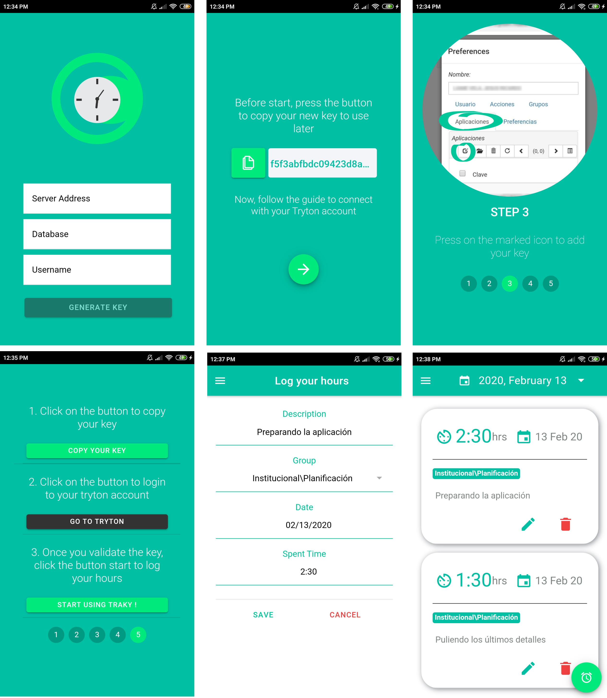

<div align="center">
    
<h4 align="center">Traky is a time traking mobile app to use with your Tryton account.</h4>
</div>

## Introduction

As we use [Tryton](https://www.tryton.org/) for our organization management, we found useful to have a **mobile app** connected to our account that helps us to track the time that involve the tasks we do on a daily basis.

Currently, there is an app that is aiming this purpose, [Chronos](https://addons.mozilla.org/es/firefox/addon/tryton-chronos/), but as it only works as a browser plugin, we decided to develop a mobile alternative.

So that, we integrated Traky to a module application which Tryton provides to manage the time-sheet lines of each user.

## About

It is being developed using the Ionic 4 framework in combination with Reactjs.

Although we focuced our work in develop a mobile version, you can also use it in its web version.

### **Features**:

- Connect with your tryton account using your user API key.
- Add, modify, delete your Tryton time sheet lines.
- Select the work/project on which you are working.
- List and filter all your time sheet lines by day.

## Start using Traky

Traky works by connecting it to a Tryton server instance, so, in first place, you need to have one configured for your organization and the timesheet module has to be activated.
Mobile and web versions ask for some information about your Tryton server to setup:

- **Server Address**
- **Username**
- **Database Name**

Once you have the app running, enter those settings to generate a new API key. Then, you should follow the instructions to validate it into the Tryton account preferences.

### Running application

#### Mobile version

You can download the last android apk from [here](https://github.com/Cambalab/Traky/releases/download/v01/Traky.zip). Just install it and start to use it.

#### Browser version

You will need to setup a Traky web instance in a server and each user would connect to it from browser.

##### How to install it

This installation is focused on Linux based Operative Systems as we will be using the command line to facilitate this process.

_Requirements:_

- Node.js v9
- NPM v6>=

Node.js can be installed downloading it from their main [website](https://nodejs.org/en/) depending on the Operative System being used. After installing it, set the node version to 9 using [nvm](https://github.com/nvm-sh/nvm/blob/master/README.md) or [npx](https://www.npmjs.com/package/npx).

Currently, the Tryton API works by require an authorization header, but it can not respond the OPTIONS method, which is necessary to send one.
We were able to fix that using a Proxy server to _skip_ these validation.

To configure this proxy, you have to create an .env file based on the example, to add the variable that save the proxy url.

If your Tryton instance also need one or you are not sure about it, you can use our proxy:

```
https://cors-anywhere.herokuapp.com/
```

In that case, the .env file should look like:

```
REACT_APP_PROXY_URL=https://cors-anywhere.herokuapp.com/
API_PORT=3000
PORT=2000
DEVELOPMENT=true
```

#### Steps:

1. Set the node version with the following command:

- `nvm install 9 && nvm use v9`

2. Clone Traky repository

- `git clone https://github.com/Cambalab/traky.git && cd traky/`

3. Install the project's dependencies:

- `npm install`

1. Create and add an .env file based on the example to save the proxy variable.

2. Finally, we can start the application running:

- `npm run start`

---

## App Preview

<div align="center">
    
</div>

---

## App compatibility

Traky supports the following platforms and versions:

| Platform | Version |
| -------- | ------- |
| Android  | 5.0+    |
| Chrome   | 5.0+    |
| Firefox  | 64>=    |
| Safari   | 12>=    |

## Contributing

See [CONTRIBUTING.md](CONTRIBUTING.md) :tada:

## License

[**GNU General Public License version 3**](https://opensource.org/licenses/GPL-3.0)

# <Divider>

<div align="center">
  <strong>👩‍💻 with :green_heart: :purple_heart: :heart: by <a href="https://camba.coop" target="_blank" rel="noopener noreferrer"> cambá.coop</a> :earth_americas: Buenos Aires, Argentina
  </strong>
</div>
